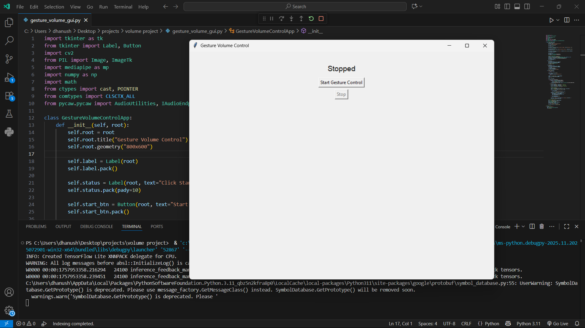
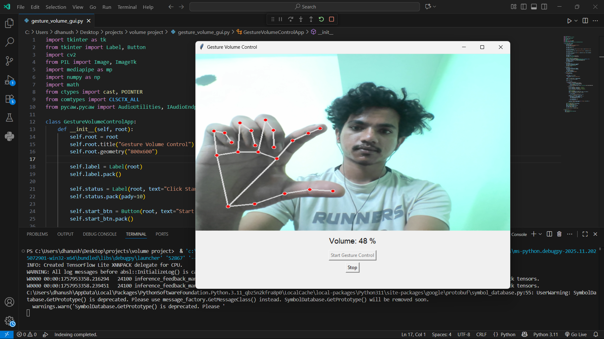

# Gesture Volume Control App 🎮🔊

An interactive **Gesture-Controlled Volume Adjustment** desktop application built with Python, OpenCV, Mediapipe, and Pycaw. The app allows users to control their system’s volume using hand gestures captured from the webcam, providing a hands-free and intuitive way to adjust sound levels.

---

## 🚀 Features

✅ Real-time hand tracking using **Mediapipe**  
✅ Volume control based on the distance between the thumb and index finger  
✅ Mute/unmute functionality by pinching the thumb and pinky finger  
✅ Visual feedback showing landmarks and current volume percentage  
✅ Smooth and responsive adjustments using interpolation  
✅ Built with **Tkinter** for an interactive GUI

---

## 📌 How it Works

1. The app captures video from the webcam using OpenCV.
2. It detects hand landmarks with Mediapipe and computes the distance between the thumb and index finger.
3. This distance is mapped to the system's volume range using interpolation.
4. Users can mute or unmute the volume by bringing the thumb and pinky fingertips together.
5. The interface updates in real-time with volume percentage and mute status.

---
✅ How to Use

Click Start Gesture Control to begin webcam feed.

Move your hand in front of the camera.

Adjust volume by spreading or closing your thumb and index finger.

Mute/unmute by pinching your thumb and pinky fingertips.

Click Stop to end the session.

-------
## 🛠️ Technologies Used

- **Python** – Main programming language  
- **OpenCV** – For webcam feed and image processing  
- **Mediapipe** – For hand landmark detection and gesture recognition  
- **Pycaw** – For controlling the system’s audio settings on Windows  
- **Tkinter** – For GUI development  
- **NumPy** – For mathematical calculations

---

## 📥 Installation & Setup

### 1️⃣ Clone the repository
git clone https://github.com/sndhanush99/Gesture-Volume-Control-App
----------------------------------
cd GestureVolumeControlApp

2️⃣ Install dependencies
pip install -r requirements.txt

3️⃣ Run the app
python GestureVolumeControl.py

📦 Dependencies

List of required libraries:

opencv-python
mediapipe
numpy
Pillow
pycaw
comtypes

You can install all dependencies using:

pip install -r requirements.txt

New folder/1.png

